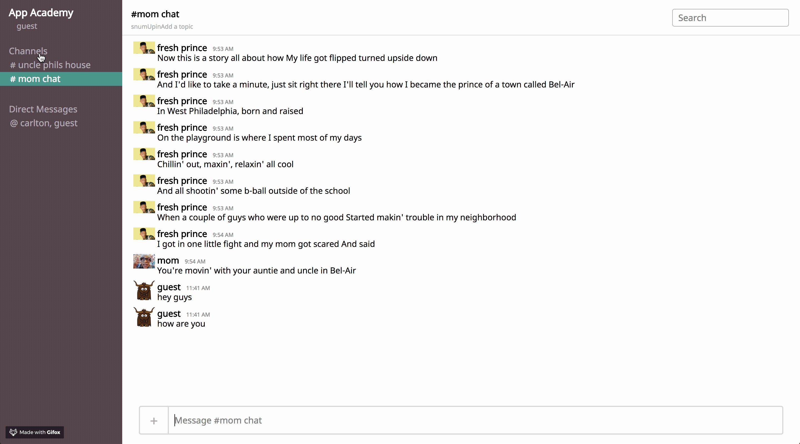

# YAK

An in-progress clone of the popular app Slack.
<br />
You can view the site <a href="https://yak1.herokuapp.com/">here!</a>

# Technologies

* Ruby on Rails

* React

* Redux

* Websockets (ActionCable)

* PostgreSQL Database

# Features

* Real-time chat


```ruby
class MessageBroadcastJob < ApplicationJob
  queue_as :default

  def perform(message)
    ActionCable.server.broadcast "room_channel", message: render_message(message)
  end

  private
    def render_message(message)
      ApplicationController.renderer.render(partial: 'api/messages/message', locals: { message: message })
    end
end
```

* Channels



* Multi-person direct messaging


